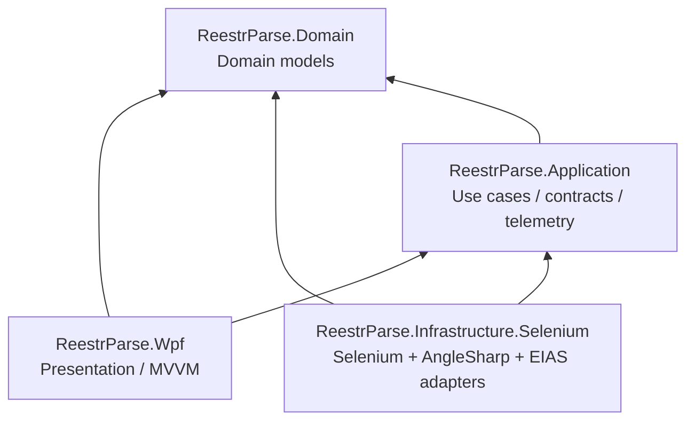
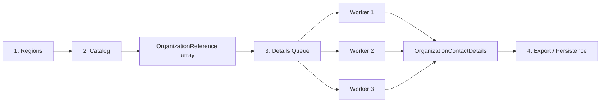
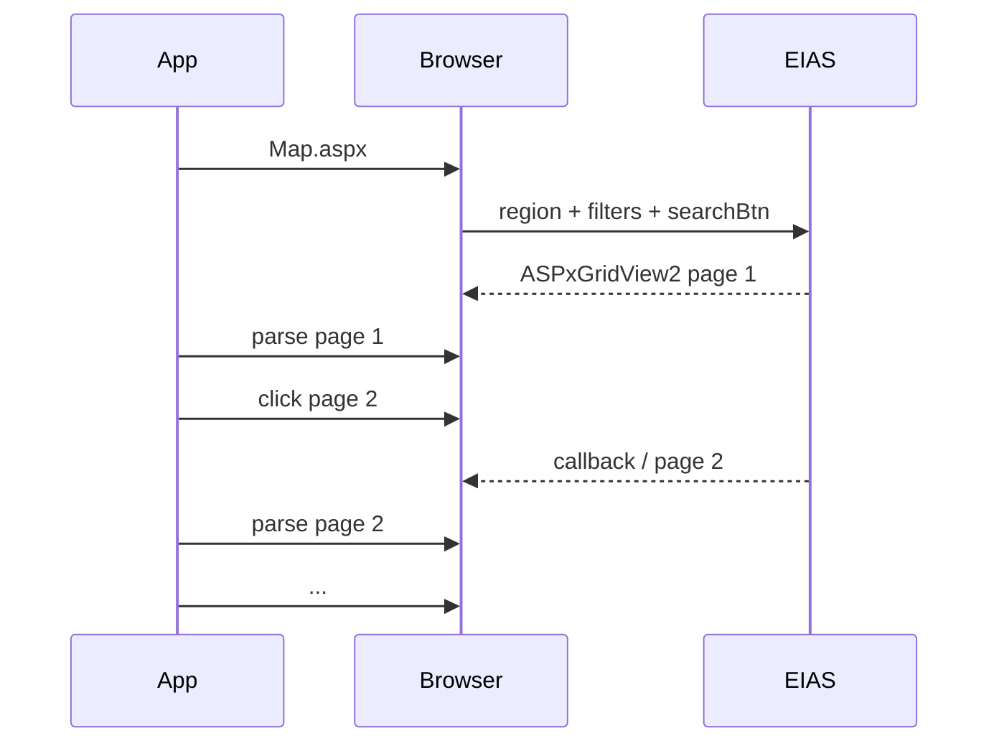
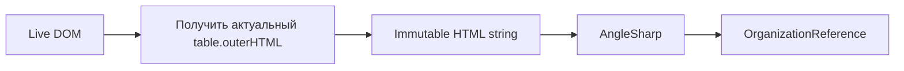
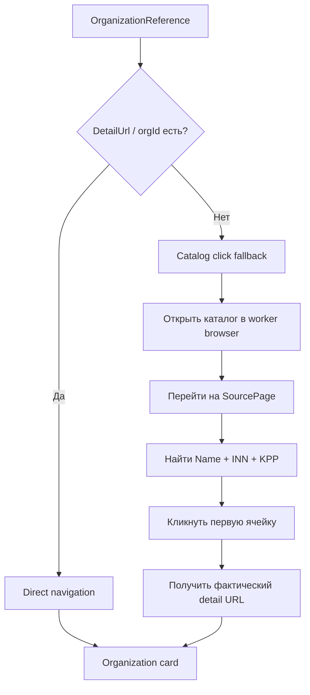
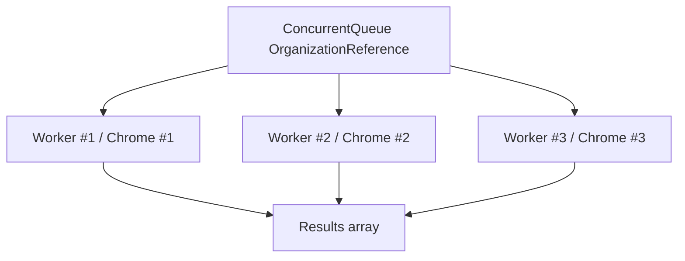
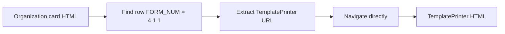
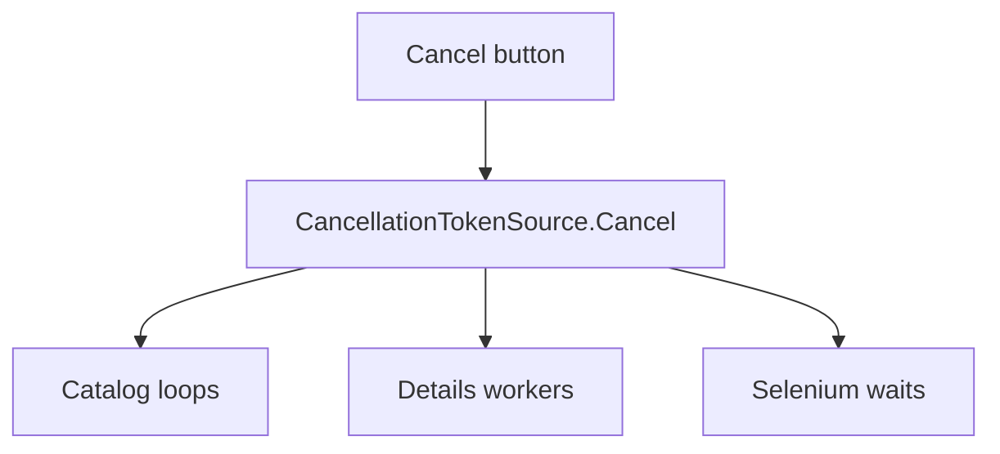
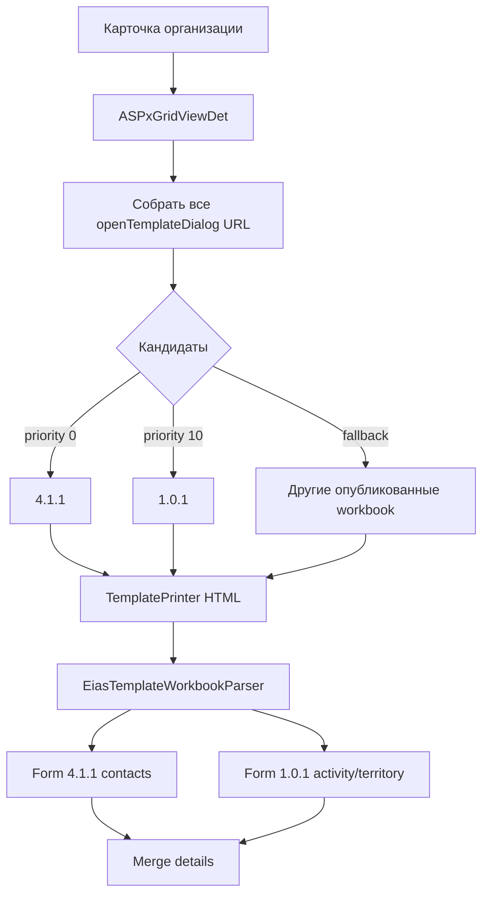
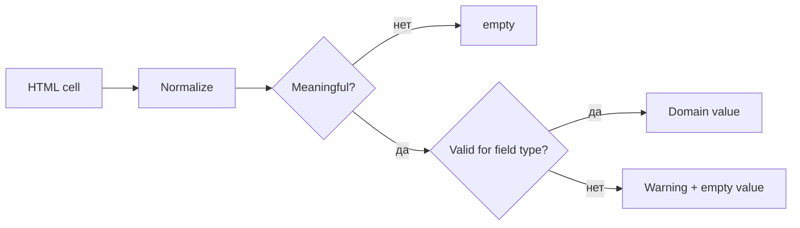

# Архитектура ReestrParse

> Технический разбор архитектуры WPF-приложения для сбора реестров ФГИС ЕИАС, обхода динамической DevExpress-пагинации и параллельного multi-form извлечения данных из 4.1.1/1.0.1.

Документ написан не только как внутренняя документация проекта, но и как описание инженерных решений: почему проект устроен именно так, какие проблемы решаются асинхронностью и параллелизмом, где проходит граница между Selenium и HTML-парсингом и как организована наблюдаемость длительного процесса.

---

## 1. Задача проекта

ReestrParse автоматизирует длинный сценарий работы с ФГИС ЕИАС:

1. открыть карту регионов;
2. выбрать субъект РФ;
3. применить фильтр сферы `Теплоснабжение`;
4. выбрать форму `Общая информация об организации`;
5. нажать `НАЙТИ`;
6. пройти динамическую DevExpress-пагинацию каталога;
7. собрать организации, ИНН, КПП и технические данные навигации;
8. для каждой организации открыть карточку;
9. обнаружить опубликованные workbook-кандидаты и приоритизировать **форму 4.1.1**;
10. получить прямой `TemplatePrinter.aspx`;
11. извлечь телефоны, email, ответственных лиц и другие контакты;
12. показать прогресс и ошибки оператору.

Главная сложность проекта — не HTML как таковой, а **stateful web UI**: Bootstrap-select, ASP.NET postback, DevExpress callbacks, динамически пересоздаваемый DOM и отсутствие гарантированного прямого URL карточки в каждой строке каталога.

---

## 2. Архитектурный стиль

Проект использует слоистую архитектуру с зависимостями, направленными внутрь:



### Почему это важно

`Domain` не знает, что приложение использует Selenium или WPF. `Application` описывает, **что** требуется сделать, а Infrastructure — **как** это делается на конкретном сайте.

Это позволяет позже заменить часть Selenium-кода на `HttpClient`, добавить EF Core, Excel export или другой UI, не переписывая предметные модели.

---

## 3. Проекты solution

### `ReestrParse.Domain`

Содержит простые модели предметной области:

- `RegionOption`;
- `SphereOption`;
- `OrganizationReference`;
- `OrganizationContactDetails`.

В этом слое нет:

- `IWebDriver`;
- WPF;
- DI;
- файловой системы;
- HTML selectors.

### `ReestrParse.Application`

Содержит контракты сценариев:

- `IEiasCatalogService`;
- `IEiasOrganizationDetailsService`;
- `CatalogProgress`;
- `DetailsProgress`;
- `DetailsCrawlOptions`;
- telemetry contracts.

Application определяет use-case, но не зависит от конкретного браузера.

### `ReestrParse.Infrastructure.Selenium`

Интеграционный слой:

- Selenium browser lifecycle;
- загрузка Map.aspx;
- Bootstrap filters;
- DevExpress grid navigation;
- извлечение row metadata;
- fallback через клик строки;
- discovery форм 4.1.1 / 1.0.1;
- прямой переход в TemplatePrinter;
- HTML parsing через AngleSharp;
- worker pool для карточек организаций.

### `ReestrParse.Wpf`

Presentation layer:

- MVVM;
- основное окно;
- таблица организаций;
- управление worker count;
- прогресс pipeline;
- отдельное окно мониторинга;
- фильтрация и экспорт runtime-логов.

---

## 4. Pipeline приложения

Полный сценарий разделён на независимые фазы.



Разделение каталога и карточек — одно из главных решений проекта.

### Почему не используется схема `каталог → карточка → Back()`

У ЕИАС возврат из карточки мог сбрасывать DevExpress grid на первую страницу. Для организации на странице 10 приходилось снова проходить страницы 1–10.

Условно старый алгоритм имел возрастающую стоимость:

```text
page 1 → org
page 2 → org → back → restore page 2
page 3 → org → back → restore page 3
...
```

Новый алгоритм сначала один раз индексирует каталог, а затем обрабатывает карточки независимо.

---

## 5. Catalog phase: почему он последовательный

Каталог — stateful DevExpress grid. Его состояние живёт внутри одной browser session.



Здесь многопоточность принесла бы мало пользы: несколько потоков конкурировали бы за состояние одного grid-а.

Поэтому применяется принцип:

> **Один stateful ресурс — один владелец browser session.**

Каталог обрабатывается одной Selenium-сессией последовательно.

---

## 6. Почему таблица парсится через HTML snapshot

DevExpress при callback полностью пересоздаёт DOM. Если сохранить `IWebElement`, после callback он становится `stale`.

Проблемный подход:

```text
FindElements()
↓
сохранили IWebElement
↓
DevExpress callback
↓
DOM заменён
↓
stale element reference
```

Используемый подход:



Selenium отвечает за состояние браузера, а AngleSharp — за стабильный разбор уже полученного snapshot.

Это уменьшает область, в которой возможен `StaleElementReferenceException`.

---

## 7. Live pager

Количество страниц нельзя надёжно брать из первого подходящего фрагмента `PageSource`: DevExpress может оставлять скрытые элементы старого состояния.

Поэтому используется `EiasLivePager`:

- ищет **актуальный отрисованный** pager;
- получает текущую страницу;
- получает число страниц;
- получает общее число строк;
- перед каждым переходом состояние перечитывается заново.

```text
visible pager: Page 1 of 3
↓
read page 1
↓
click page 2
↓
read LIVE pager again
↓
Page 2 of 3
```

Так приложение не продолжит искать страницу 8, если после фильтра осталось только 3 страницы.

---

## 8. `OrganizationReference` как граница между фазами

После каталога приложение получает не браузерные элементы, а immutable-ish DTO:

```text
OrganizationReference
├── Name
├── INN
├── KPP
├── SourcePage
├── OrganizationId
├── DetailUrl
├── RegionId
├── SphereId
└── FormValue
```

Это важная архитектурная граница.

Details phase больше не зависит от live DOM исходного каталога.

---

## 9. Direct URL и fallback

Не все каталоги ЕИАС отдают `orgId` через client-side DevExpress metadata.

Поэтому применяется гибридный алгоритм.



Fallback выполняется **не в основной catalog-session**, а в отдельном worker browser. Поэтому основной каталог не теряет свою страницу.

---

## 10. Details phase и многопоточность

После завершения каталога карточки организаций независимы друг от друга. Это хороший кандидат на параллельную обработку.



### Важное правило Selenium

Один `IWebDriver` не разделяется между потоками.

Каждый worker владеет собственной Selenium-сессией:

```text
Worker 1 → ChromeDriver 1
Worker 2 → ChromeDriver 2
Worker 3 → ChromeDriver 3
```

Это предотвращает гонки навигации, frame context и DOM state.

### Почему worker живёт долго

Браузер создаётся один раз на worker и обрабатывает несколько организаций.

Плохой вариант:

```text
organization 1 → start Chrome → close Chrome
organization 2 → start Chrome → close Chrome
```

Хороший вариант:

```text
start Chrome once
↓
org 1
org 4
org 7
...
↓
close Chrome
```

Это экономит время запуска browser process и Selenium session.

---

## 11. Асинхронность и многопоточность — разные вещи

В проекте важно различать несколько терминов.

### Асинхронность

Асинхронность позволяет не блокировать UI-поток WPF, пока выполняется длительная операция.

```csharp
await _catalog.LoadOrganizationsAsync(...);
```

UI message loop продолжает работать:

- окно перерисовывается;
- progress обновляется;
- кнопка отмены реагирует;
- монитор логов остаётся интерактивным.

Асинхронность сама по себе не означает выполнение на нескольких CPU-потоках.

### Параллелизм

Параллелизм означает одновременную работу нескольких независимых workers.

В details phase несколько ChromeDriver действительно могут работать одновременно.

### Многопоточность

`Task.Run` workers выполняют блокирующую Selenium-работу вне UI thread. У каждого worker отдельная Selenium session.

### Thread-safe coordination

Для счётчиков используются атомарные операции:

```text
Interlocked.Increment
Volatile.Read
```

Очередь организаций реализована через thread-safe `ConcurrentQueue`.

---

## 12. Почему форма 4.1.1 не открывается через модальный UI

На странице организации строка формы содержит вызов:

```text
openTemplateDialog('https://ri-loader.eias.ru/TemplatePrinter.aspx?...')
```

UI сайта далее открывает этот URL в iframe. Автоматизация не повторяет лишние визуальные действия.

Используется оптимизация:



Не выполняются:

- click preview icon;
- ожидание jQuery dialog;
- switch to iframe;
- resize dialog;
- click workbook tabs.

Это уменьшает число Selenium-actions и число потенциальных `stale`/timing errors.

---

## 13. Почему лист 4.1.1 ищется структурно

TemplatePrinter содержит HTML-представление нескольких Excel-листов. Нужный лист уже присутствует в DOM.

Парсер ищет таблицу, содержащую заголовок:

```text
Форма 4.1.1 Общая информация об организации
```

Затем данные читаются не по физическим номерам HTML-строк, а по бизнес-кодам формы.

Примеры:

| Код | Значение |
| --- | --- |
| `2.1` | Наименование организации |
| `2.2` | ИНН |
| `2.3` | КПП |
| `3.3` | Телефон ответственного лица |
| `3.4` | Email ответственного лица |
| `7.1` | Телефон организации |
| `8` | Сайт |
| `9` | Email организации |

Это устойчивее к добавлению новых строк и изменению HTML layout.

---

## 14. Наблюдаемость: telemetry вместо `Console.WriteLine`

Длительный crawler без observability сложно поддерживать. Поэтому Application содержит отдельный контракт:

```text
IParserTelemetry
        │
        ▼
ParserTelemetryHub
        │
        ├── MainWindowViewModel
        └── ParserMonitorWindowViewModel
```

Infrastructure публикует события, но не знает, как UI их отобразит.

### Что содержит telemetry event

- timestamp;
- level;
- pipeline stage;
- operation;
- message;
- duration;
- worker id;
- source page;
- item index / total items;
- success/error counters;
- organization name;
- INN;
- error text.

### Примеры событий

```text
Catalog / Page parsed / page 2/3 / 1.42 s
Worker #2 / Organization started / item 18/104 / source page 1
Worker #2 / Organization card loaded / 0.81 s
Worker #2 / 4.1.1 link extracted / 24 ms
Worker #2 / TemplatePrinter loaded / 1.27 s
Worker #2 / 4.1.1 parsed / 11 ms
Worker #2 / Organization completed / 2.18 s
```

---

## 15. Отдельное окно мониторинга

Подробные runtime-данные не помещаются в основной DataGrid и мешают оператору работать с результатом.

Поэтому монитор вынесен в отдельное WPF-окно.

```text
MainWindow
├── регионы / фильтры
├── каталог и контакты
├── общий progress
└── [Мониторинг / логи]
          │
          ▼
ParserMonitorWindow
├── stage / operation
├── processed / total
├── OK / ERR
├── workers
├── source page
├── average item time
├── throughput
├── elapsed
├── ETA
├── progress bar
├── latest error
└── detailed log grid
```

Время и ETA обновляются UI-таймером даже в паузах между telemetry-событиями.

Журнал ограничен 5000 строками в UI, чтобы многочасовой прогон не деградировал из-за роста `ObservableCollection`.

Полный runtime-журнал можно экспортировать в CSV/TXT.

---

## 16. Pipeline state в основном UI

Sidebar показывает не статические подписи, а реальные состояния:

```text
1. Регион и фильтры
2. Каталог
3. Карточки и формы 4.1.1 / 1.0.1
4. Экспорт
```

`CurrentPipelineStep` меняется из telemetry events и пользовательских use-case'ов.

Например:

```text
Regions            → step 1
CatalogNavigation  → step 2
CatalogPages       → step 2
DetailsQueue       → step 3
DetailsForm411     → step 3
```

Таким образом UI отображает фактическое состояние backend-процесса, а не просто последнюю нажатую кнопку.

---

## 17. Progress и ETA

### Catalog progress

```text
current page / total pages
```

### Details progress

```text
completed organizations / total organizations
```

### Среднее время

Для завершённых организаций сохраняются последние duration samples.

```text
average = sum(duration) / completed samples
```

### Throughput

```text
organizations per minute = 60 / average_seconds
```

### ETA

Приближённая оценка:

```text
ETA ≈ average_item_time × remaining_items / active_workers
```

Это не строгий прогноз: разные организации могут иметь различное время ответа, но оператор получает полезную оценку масштаба оставшейся работы.

---

## 18. Cancellation

Каждый публичный use-case принимает `CancellationToken`.

Отмена распространяется вниз по pipeline:



Это cooperative cancellation: код регулярно вызывает `ThrowIfCancellationRequested()` в длинных циклах.

---

## 19. Обработка ошибок

Ошибки делятся на два уровня.

### Fatal pipeline error

Например не удалось открыть страницу поиска. Use-case завершается ошибкой.

### Item-level error

Например одна организация не открыла TemplatePrinter.

В details phase ошибка отдельной организации:

- записывается в `OrganizationDetailsResult`;
- публикуется в telemetry;
- worker продолжает брать следующую организацию;
- общий pipeline не падает.

Это принцип **fault isolation**: одна плохая запись не должна останавливать обработку сотен остальных.

---

## 20. Почему используются Selenium и AngleSharp одновременно

Это не дублирование технологий, а разделение ответственности.

### Selenium

Нужен там, где существует browser state:

- postback;
- JavaScript;
- DevExpress callbacks;
- выбор Bootstrap controls;
- переходы;
- browser cookies/session.

### AngleSharp

Нужен там, где после загрузки уже достаточно статического DOM snapshot:

- таблица каталога;
- строка формы 4.1.1;
- TemplatePrinter;
- значения формы.

Правило проекта:

> **Selenium управляет состоянием, AngleSharp читает данные.**

---

## 21. SOLID в проекте

### Single Responsibility

- `EiasRegionSelector` — регионы;
- `EiasPagerNavigator` — pagination;
- `EiasOrganizationGridReader` — каталог;
- `EiasOrganizationPageReader` — карточка;
- `EiasForm411Parser` — форма 4.1.1;
- `ParserTelemetryHub` — runtime events.

### Dependency Inversion

WPF зависит от `IEiasCatalogService` и `IEiasOrganizationDetailsService`, а не от `ChromeDriver`.

### Open/Closed

Добавление новой формы можно реализовать новым parser/use-case, не меняя основной каталог.

---

## 22. Где проект можно развивать дальше

### Excel export

Отдельный Application contract:

```text
IOrganizationExporter
```

Infrastructure implementation:

```text
ClosedXmlOrganizationExporter
```

### Persistence / resume

Можно добавить:

```text
ICrawlCheckpointStore
```

и EF Core implementation, чтобы после падения продолжать с необработанных организаций.

### Retry policy

Для transient ошибок:

```text
Timeout
WebDriverException
502 / temporary service errors
```

можно добавить ограниченный retry с backoff.

### HTTP fast path

Если TemplatePrinter стабильно отвечает с browser cookies/без них, HTML можно получать `HttpClient`, оставив Selenium только для discovery/navigation.

---

## 23. Термины для обсуждения на собеседовании

**Crawler** — система, которая последовательно обнаруживает и обходит набор ресурсов.

**Scraper** — компонент, извлекающий структурированные данные из полученного документа.

**Stateful UI** — интерфейс, в котором результат следующего действия зависит от текущего server/browser state.

**DOM snapshot** — неизменяемая копия текущего HTML, используемая для стабильного парсинга.

**Stale element** — Selenium-ссылка на DOM-node, который был удалён/заменён после обновления страницы.

**Worker pool** — фиксированное число долгоживущих исполнителей, получающих задачи из общей очереди.

**Bounded parallelism** — ограничение степени параллелизма вместо запуска одной задачи/браузера на каждую запись.

**Throughput** — количество обработанных элементов за единицу времени.

**Latency** — время обработки одного элемента/операции.

**ETA** — оценка времени до завершения.

**Observability** — возможность понять внутреннее состояние системы через события, метрики, timings и ошибки.

**Fault isolation** — ошибка одного элемента не останавливает остальные элементы batch-а.

**Cooperative cancellation** — операции сами периодически проверяют `CancellationToken` и корректно завершаются.

**Dependency inversion** — высокоуровневый UI/use-case зависит от интерфейса, а Selenium выступает его реализацией.

---

## 24. Краткое объяснение архитектуры на собеседовании

Можно описать проект так:

> «Я разделил scraper на две фазы. Сначала одна Selenium-сессия последовательно проходит stateful DevExpress-каталог и материализует организации в DTO. Я специально не открываю карточки во время пагинации, потому что возврат сбрасывал состояние списка и приводил к повторному обходу страниц. После завершения каталога карточки становятся независимыми задачами, поэтому они обрабатываются ограниченным пулом отдельных ChromeDriver workers. Один WebDriver между потоками не разделяется. Для динамической навигации используется Selenium, а полученный стабильный HTML разбирается AngleSharp. Длительный pipeline инструментирован собственным telemetry hub: UI показывает этапы, прогресс, worker activity, page/item timings, throughput, ETA и ошибки. Ошибка одной организации изолируется и не останавливает batch.»

Это отражает основные инженерные решения проекта: **separation of concerns, bounded parallelism, state isolation, snapshot parsing, cancellation, fault isolation и observability**.

---

## 16. Multi-form parsing: 4.1.1 + 1.0.1

Начиная с v0.9 details pipeline рассматривает `TemplatePrinter` как **workbook**, а не как одну выбранную форму.



### Почему это устойчивее

Раньше отсутствие отдельной строки `4.1.1` в `ASPxGridViewDet` сразу считалось ошибкой. Но опубликованный workbook может содержать сразу несколько листов. Поэтому теперь worker может открыть другой опубликованный `TemplatePrinter` и проверить фактически присутствующие листы.

### Разделение ответственности форм

`4.1.1` — основной источник идентификационных и контактных данных:

- организация / ИНН / КПП;
- телефон и email организации;
- сайт;
- ответственное лицо;
- руководитель;
- адреса.

`1.0.1` — источник контекста раскрытия:

- дата заполнения/изменения;
- централизованная система;
- регулируемый вид деятельности;
- субъект РФ;
- муниципальный район;
- муниципальное образование.

Форма 1.0.1 **не используется для выдумывания отсутствующих контактов**.

---

## 17. Partial result вместо бинарного success/error

Для внешних государственных систем полезно различать три результата:

```text
Full     — форма 4.1.1 успешно прочитана
Partial  — 4.1.1 отсутствует, но получены данные 1.0.1
Failed   — не удалось получить ни один полезный лист
```

Это пример graceful degradation: одна отсутствующая форма не уничтожает всё, что удалось получить по организации.

В Domain это отражено через:

```text
HasForm411
HasForm101
IsPartial
ParsedForms
Warnings[]
```

UI поэтому показывает не только «Ошибка», но и «Частично».

---

## 18. Data quality как отдельный этап pipeline

Web scraping — это не только получение DOM. Даже успешно прочитанная ячейка может содержать значение неправильного типа.

Например, код `9` формы 4.1.1 семантически является email. Если ЕИАС возвращает URL загрузки или другой служебный текст, парсер:

1. не записывает его как email;
2. сохраняет пустое нормализованное поле;
3. публикует warning;
4. сохраняет исходное проблемное значение в диагностическом сообщении.



Так слой parsing отделяется от слоя validation.

---

## 19. Adaptive catalog fallback

`SourcePage`, записанная во время catalog phase, полезна, но не должна считаться абсолютной истиной. Порядок строк DevExpress может отличаться между независимыми worker-сессиями.

Поэтому fallback использует порядок страниц:

```text
preferred
preferred - 1
preferred + 1
preferred - 2
preferred + 2
...
```

На каждой странице worker ждёт появление строки и применяет стратегии сопоставления:

```text
1. Name + INN + KPP
2. INN + KPP
3. unique INN
```

Это пример **hint-based navigation** вместо fragile positional navigation.

---

## 20. Structured observability

В v0.9 telemetry перестала быть только текстовым журналом.

`ParserTelemetryEvent` содержит:

```text
Stage
Operation
Duration
WorkerId
Page / TotalPages
ItemIndex / TotalItems
Succeeded / Partial / Failed
OrganizationName / INN
Code
DataSource
Error
```

Пример кодов:

```text
CATALOG_ROW_NOT_ON_PAGE
CATALOG_ROW_MATCHED
TEMPLATE_CANDIDATE_FAILED
FORM_411_UNAVAILABLE_FORM101_FALLBACK
```

Это даёт возможность отвечать на инженерные вопросы:

- на каком этапе больше всего ошибок;
- какой fallback используется чаще всего;
- какая операция самая дорогая;
- какие ошибки связаны с навигацией, а какие — с данными;
- сколько организаций обработано полностью/частично/с ошибкой.

---

## 21. Что здесь является async, parallelism и multithreading

### Async/await

WPF-команды запускают длительные операции асинхронно, чтобы UI dispatcher не блокировался.

```text
UI thread
   ↓ await
I/O / crawler operation
   ↓
UI remains responsive
```

Асинхронность сама по себе не означает, что несколько браузеров работают одновременно.

### Parallelism

Details phase создаёт несколько независимых worker-задач. Они одновременно обрабатывают разные организации.

### Multithreading

Каждый Selenium driver имеет собственную browser session. Один `IWebDriver` не разделяется между workers. Это принципиально: WebDriver и stateful DOM конкретной вкладки не являются безопасным shared mutable state для параллельного доступа.

### Cancellation

`CancellationToken` проходит через catalog/details pipeline. Остановка пользователя должна завершить очередь без аварийного закрытия UI.

### Fault isolation

Исключение одной организации превращается в `OrganizationDetailsResult` с ошибкой и не останавливает остальные workers.

Это сочетание можно описать на собеседовании как:

> UI использует asynchronous orchestration, каталог обрабатывается последовательно из-за stateful DevExpress pagination, а независимые карточки организаций масштабируются через bounded parallel worker model с отдельным Selenium WebDriver на worker и fault isolation на уровне item.

---

## 22. Почему основной DataGrid остаётся компактным

Не все собранные данные нужны оператору одновременно. Поэтому основной DataGrid содержит наиболее полезные поля, а дополнительные данные показываются через `RowDetails` при выборе строки:

- распознанные формы;
- сайт;
- должность ответственного;
- адреса;
- инфраструктурные системы;
- виды деятельности;
- территория;
- data-quality warnings.

Это позволяет расширять модель без горизонтального DataGrid на десятки колонок.

## Card-open recovery (v0.9.3)

Catalog row click is not treated as success by itself. A Worker verifies that the browser actually entered an organization card. If a DevExpress callback/click stalls, the Worker performs up to five complete attempts. Every attempt starts from the catalog URL, reapplies the same filters, waits for a stable grid, navigates to the target page, finds the row again, clicks it, and verifies card DOM/URL. Stale row elements are never reused across attempts.
